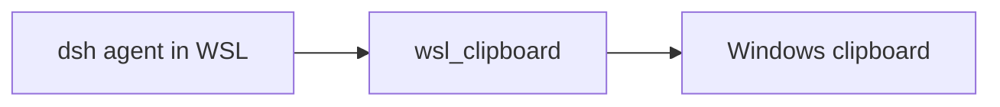

# dsh-wsl-clipboard
> **Install set:** part of [dsh-wsl-kit](https://github.com/173787247/dsh-wsl-kit). Prefer `KIT_SET=daily` | `llm` | `github` | `full` (see kit README). Fault tree: [TROUBLESHOOTING.md](https://github.com/173787247/dsh-wsl-kit/blob/master/docs/TROUBLESHOOTING.md).


DeepSeek Harness tool: **`wsl_clipboard`** — read or write the **Windows** clipboard from an agent in WSL.

Part of **[dsh-wsl-kit](https://github.com/173787247/dsh-wsl-kit)**.

[中文说明 → README.zh.md](./README.zh.md)

## Where it sits

Reads or writes the Windows clipboard from the agent in WSL.



Suite diagram and version snapshot: [dsh-wsl-kit](https://github.com/173787247/dsh-wsl-kit#how-the-pieces-fit). This plugin is **0.1.0** (daily). Do not copy that matrix into this README.


---
## Compatibility

| Field | Value |
|-------|-------|
| **Plugin** | `dsh-wsl-clipboard` **0.1.0** |
| **Minimum dsh** | ≥ **0.1.2** (web UI one-shot `?token=` on Windows relay `:3081`) |
| **Latest verified** | See [dsh-wsl-kit Compatibility](https://github.com/173787247/dsh-wsl-kit#compatibility-2026-09) (currently **`0.1.7-alpha.2`**) — single source of truth for the suite |
| **Kit set** | `daily` (also in `github` / `full`; fetch+net also in `llm`) |
| **Cloud Flash** | Use model id **`deepseek-flash`** (V4.1 Flash) in `~/.dsh/settings.yaml` / `llm-deepseek` — not configured by this plugin |
| **Agent Teams** | Upstream experimental; not required here |

Suite floor versions: kit [`check-plugin-versions.sh`](https://github.com/173787247/dsh-wsl-kit/blob/master/scripts/check-plugin-versions.sh). Fault tree: [TROUBLESHOOTING.md](https://github.com/173787247/dsh-wsl-kit/blob/master/docs/TROUBLESHOOTING.md).

## Why

Copying a Linux path, command, or snippet into Notepad / ChatGPT / Explorer is awkward when the agent only lives in WSL. This tool bridges the Windows clipboard via PowerShell.

## Tool

| Arg | Required | Meaning |
|-----|----------|---------|
| `action` | yes | `get` or `set` |
| `text` | for `set` | UTF-8 text to place on the clipboard |

Long text is truncated by `maxChars` (default 100000). Do **not** put secrets on the clipboard unless the user asks.

## Install

```sh
dsh plugin --profile web add github:173787247/dsh-wsl-clipboard
```

Restart `dsh web`. New session → Tools should list `wsl_clipboard`.

## Config

```yaml
- id: dsh-wsl-clipboard
  name: dsh-wsl-clipboard
  config:
    timeoutMs: 15000
    maxChars: 100000
```

| Key | Default | Meaning |
|-----|---------|---------|
| `timeoutMs` | `15000` | Tool timeout |
| `maxChars` | `100000` | Max clipboard text length |

## Test

```sh
npm test
```

## License

MIT
